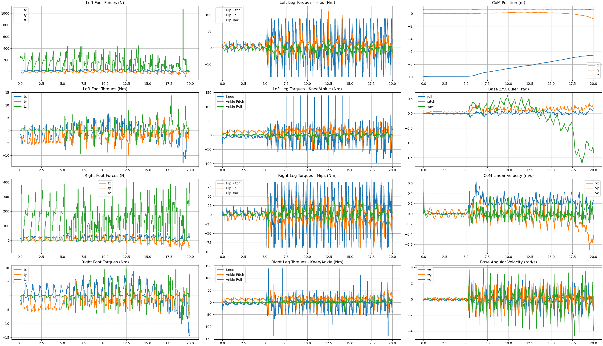
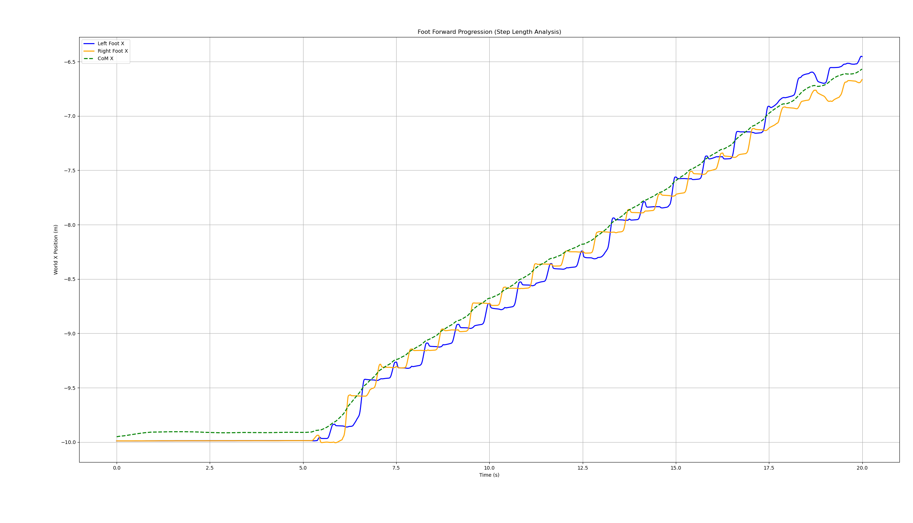
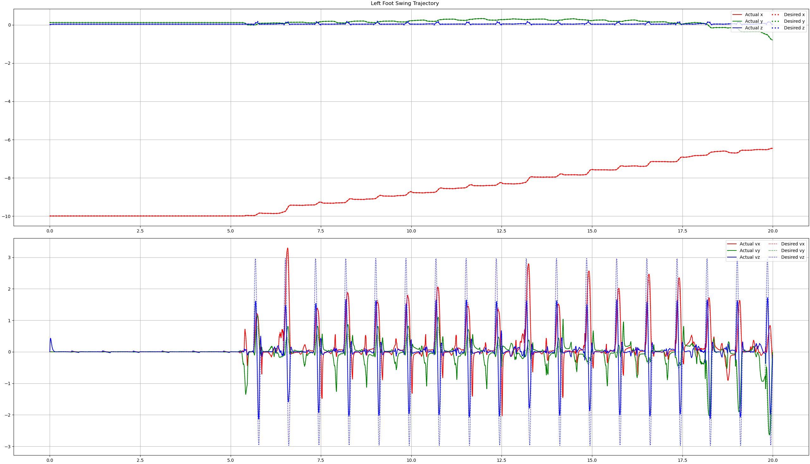

# BHEEMA — Bipedal Humanoid Equilibrium via Efficient Model-predictive Architecture

A classical model-predictive control pipeline for bipedal humanoid walking — no reinforcement learning, just physics and optimization. Built from the ground up following the methodology in [Dynamic Locomotion in the MIT Cheetah 3 Through Convex Model-Predictive Control](https://dspace.mit.edu/bitstream/handle/1721.1/138000/convex_mpc_2fix.pdf), adapted for the two-legged case on Unitree's G1 humanoid.

https://github.com/user-attachments/assets/8cb457dd-af82-4a62-9796-869882d03797

---

## Why this exists

Most humanoid walking demos today use reinforcement learning, train a policy in simulation and hope it transfers. That works, but it's a black box. You can't inspect why the robot chose a particular footstep, you can't tune the controller to handle a new scenario without retraining, and you can't guarantee constraint satisfaction.

BHEEMA takes the opposite approach: every decision the robot makes is the solution to an optimization problem with explicit physics constraints. The contact forces satisfy friction cones. The torques respect actuator limits. The CoM trajectory follows a dynamically feasible path. If the robot falls, you can look at the QP solution and know exactly why.

This is the same control architecture that powered MIT's Mini Cheetah at 3.7 m/s — adapted for a biped.

---

## How it works

The controller runs a three-layer pipeline at different frequencies, each layer feeding the next:

```
Centroidal MPC (16 Hz)      →   What contact forces should each foot apply?
Leg Controller (200 Hz)     →   What joint torques realize those forces?
MuJoCo Physics (2000 Hz)    →   What happens when we apply those torques?
```

### Centroidal MPC

The top layer models the robot as a single rigid body with two contact points, one per foot. It solves a convex QP every 62.5ms to find the optimal ground reaction forces over a 1.5-second lookahead horizon.

The state vector tracks 12 quantities: CoM position, orientation (roll/pitch/yaw), linear velocity, and angular velocity. The control inputs are 6D wrenches (forces + torques) at each foot, giving 12 control variables total.

The dynamics are linearized around small roll/pitch angles (the key insight from the MIT Cheetah paper), which keeps the QP convex and solvable in under 5ms using CasADi with the OSQP backend. The linearization assumes the robot stays roughly upright, which is enforced by penalizing roll/pitch deviations heavily in the cost function rather than through hard constraints (hard constraints cause QP infeasibility when the robot drifts).

Constraints enforced at the QP level:
- **Friction pyramid**: horizontal forces bounded by friction coefficient times normal force
- **Unilateral contact**: feet can only push, not pull
- **Center of Pressure**: ankle torques bounded by foot geometry
- **Torsional friction**: yaw torque limited to prevent spinning
- **Force bounds**: explicit caps on horizontal forces to prevent aggressive corrections

### Reference Trajectory Generator

Before each MPC solve, the trajectory generator builds the reference the QP tries to track. This includes the CoM position/velocity path (with lateral sway for weight shifting during single support), the orientation targets (roll and pitch at zero, yaw tracking the commanded heading), and the foot lever arms predicted over the horizon using a dummy forward kinematics model.

The lateral sway is critical for bipedal walking and doesn't exist in quadruped implementations, during single support, the CoM reference shifts toward the stance foot so the MPC knows to push the robot sideways before lifting the swing foot.

### Gait Scheduler and Footstep Planner

A phase-based gait scheduler determines which feet are in stance and which are in swing at each point in the MPC horizon. The schedule is parameterized by frequency and duty cycle.

Footstep placement uses a Raibert-style heuristic: the touchdown target combines the hip-under position, a velocity-proportional drift term, and feedback corrections on both CoM position and velocity error. This is the same approach from the MIT Cheetah paper (Eq. 12-15), extended to handle the wider lateral offset needed for bipedal stance width. Swing trajectories are generated using 5th-order minimum-jerk polynomials with parabolic height clearance curves.

### Leg Controller

The leg controller runs at 200 Hz and handles two distinct modes:

**Stance phase** maps the MPC contact wrench to joint torques through the foot Jacobian transpose, with gravity and Coriolis compensation. A joint-space PD controller provides closed-loop stiffness to prevent drift between MPC updates — without this feedback layer, the open-loop feedforward is not robust to any perturbation.

```
tau_stance = J^T * F_contact + (C*dq + g) + Kp*(q_nom - q) - Kd*dq
              ↑ MPC forces      ↑ gravity comp    ↑ stabilizing PD
```

**Swing phase** tracks a minimum-jerk foot trajectory using operational-space impedance control with full 6D spatial Jacobians. Foot orientation is actively regulated to stay flat relative to the ground.

### Pinocchio / MuJoCo Interface

Pinocchio (analytical Jacobians and dynamics) and MuJoCo (physics simulation) interpret the MJCF freejoint differently. MuJoCo treats the freejoint position as absolute world position. Pinocchio's MJCF parser treats it as relative to the body's reference frame origin. For the G1, this creates a 0.793m vertical offset that corrupts every Jacobian, gravity term, and CoM calculation if not corrected. The state synchronization layer handles this mapping in both directions.

---

## Results

The robot achieves stable forward locomotion on the Unitree G1 (34.4 kg, 29 DOF):

| Parameter | Value |
|---|---|
| CoM height | 0.66m (bent-knee stance) |
| Stance width | 0.20m |
| Gait frequency | 1.1 Hz |
| Gait duty cycle | 80% stance |
| MPC solve time | ~1.4ms average |
| Real-time budget | 62.5ms per MPC cycle |
| Actuator limits | Hardware-matched (88/139/50 Nm) |

### Telemetry

**Contact forces, joint torques, CoM tracking, and base orientation** over 20 seconds of walking. Standing phase (0-5s) shows the robot holding position with minimal torque. Walking phase (5-20s) shows clean alternating gait with bounded forces and stable orientation. Roll, pitch, and yaw stay within ±0.5 rad throughout. Forward velocity tracks the commanded speed.



**Foot forward progression** showing alternating left/right footsteps with the CoM advancing between them. The staircase pattern in each foot's x-position shows clean stance (flat) and swing (stepping forward) phases. The robot covers over 3 meters in 15 seconds of walking.



**Swing foot trajectory tracking.** Top panel: actual vs desired foot position in x, y, z — the foot tracks the minimum-jerk reference closely. Bottom panel: foot velocities showing the characteristic bell-shaped velocity profile of minimum-jerk trajectories during each swing phase.



---

## Architecture

```
main.py                     Simulation loop, control scheduling, logging
├── g1_config.py            Pinocchio model, FK, Jacobians, dynamics
├── g1_mujoco.py            MuJoCo interface, state sync, actuator mapping
├── centroidal_mpc.py       QP formulation, OSQP solver, constraint assembly
├── com_traj.py             Reference trajectory with lateral sway
├── gait.py                 Phase-based scheduler, Raibert footstep planner
├── leg_controller.py       Stance (J^T + PD) and swing (impedance) control
└── plotter.py              Post-flight telemetry visualization
```

Key design decisions in each module:

- **centroidal_mpc.py** — Builds the sparse Hessian, assembles dynamics constraints from time-varying Ad/Bd matrices, friction pyramids, CoP limits, and force bounds. Warm-starts primal/dual variables across solves. Uses soft cost penalties on orientation instead of hard state constraints to avoid QP infeasibility.

- **com_traj.py** — Generates the 12-state reference trajectory over the MPC horizon. The lateral sway logic shifts the CoM reference toward the stance foot during single support — this is the main addition over quadruped formulations.

- **leg_controller.py** — Stance mode maps 6D wrenches through the spatial Jacobian transpose with gravity compensation and PD stabilization. Swing mode runs 6D operational-space impedance control with feedforward acceleration from the minimum-jerk trajectory.

- **g1_mujoco.py** — Handles the Pinocchio/MuJoCo state mapping including the 0.793m body offset correction, quaternion convention conversion (MuJoCo: wxyz, Pinocchio: xyzw), and velocity frame transformation (MuJoCo: world-frame linear velocity, Pinocchio: body-frame).

---


### Dependencies

- [MuJoCo](https://github.com/google-deepmind/mujoco) — physics simulation
- [Pinocchio](https://github.com/stack-of-tasks/pinocchio) — rigid-body dynamics and analytical Jacobians
- [CasADi](https://web.casadi.org/) + OSQP — numerical optimization for the convex QP
- NumPy, SciPy, Matplotlib

### Running

```bash
git clone https://github.com/siddarth09/Bheema.git
cd bheema
pip install mujoco pinocchio casadi numpy scipy matplotlib
python main.py
```

The MuJoCo viewer opens with the G1 standing, then walking forward after the warmup period. Close the viewer to see the telemetry plots.

### Configuration

Key parameters in `main.py`:

```python
NOMINAL_Z = 0.66        # CoM height (calibrated from Pinocchio FK)
GAIT_HZ = 1.1           # Step frequency
GAIT_DUTY = 0.80        # Fraction of gait cycle in stance
CTRL_HZ = 200           # Leg controller rate
MPC_DT = GAIT_T / 16    # MPC timestep (~62.5ms)
```

Walking commands are defined as a schedule of velocity phases:

```python
CMD_SCHEDULE = [
    BodyCmdPhase(0.0, 5.0, 0.0, 0.0, NOMINAL_Z, 0.0),    # Stand
    BodyCmdPhase(5.0, 60.0, 0.5, 0.0, NOMINAL_Z, 0.0),    # Walk forward
]
```

---

## Lessons learned

Some hard-won insights from building this:

**The Pinocchio/MuJoCo body offset** was the single most impactful bug. A 0.793m vertical mismatch meant every Jacobian, gravity term, and CoM position was wrong. The robot would free-fall from 1.5m while the controller thought it was at 0.66m. Always verify your kinematic model matches your simulator by printing both CoM positions side by side.

**Open-loop feedforward is not enough.** The MIT Cheetah paper's WBIC outputs joint positions for a high-rate PD controller. Without that PD layer, the stance legs have zero stiffness and any perturbation grows without bound. The robot crumpled to the ground with mathematically correct but practically useless torques.

**Hard state constraints kill the QP.** Clamping roll/pitch/yaw to ±15 degrees seems reasonable until yaw drifts to 16 degrees — then the QP is infeasible and returns garbage forces. Use soft costs (high Q weights on pitch and roll) instead. This keeps the linearization valid without risking solver failures.

**Bipedal sway is not optional.** Quadruped implementations don't need lateral CoM shifting because four legs provide a wide support polygon. A biped must actively shift its CoM over the stance foot before lifting the swing foot.

**Start with standing.** Every time I tried to debug walking without stable standing first, I wasted hours. Get double-support standing rock solid, then add gait cycling, then velocity commands. Each layer depends on the one below.

---

## References

- Di Carlo et al., [Dynamic Locomotion in the MIT Cheetah 3 Through Convex Model-Predictive Control](https://dspace.mit.edu/bitstream/handle/1721.1/138000/convex_mpc_2fix.pdf), IROS 2018
- Kim et al., [Highly Dynamic Quadruped Locomotion via Whole-Body Impulse Control and Model Predictive Control](https://ieeexplore.ieee.org/document/8594448), IROS 2019
- Acosta & Posa, [Bipedal Walking on Constrained Footholds with MPC Footstep Control](https://arxiv.org/abs/2309.07993), 2023
- [Go2 Convex MPC](https://github.com/elijah-waichong-chan/go2-convex-mpc) — quadruped reference implementation that informed the cost matrix tuning

---


